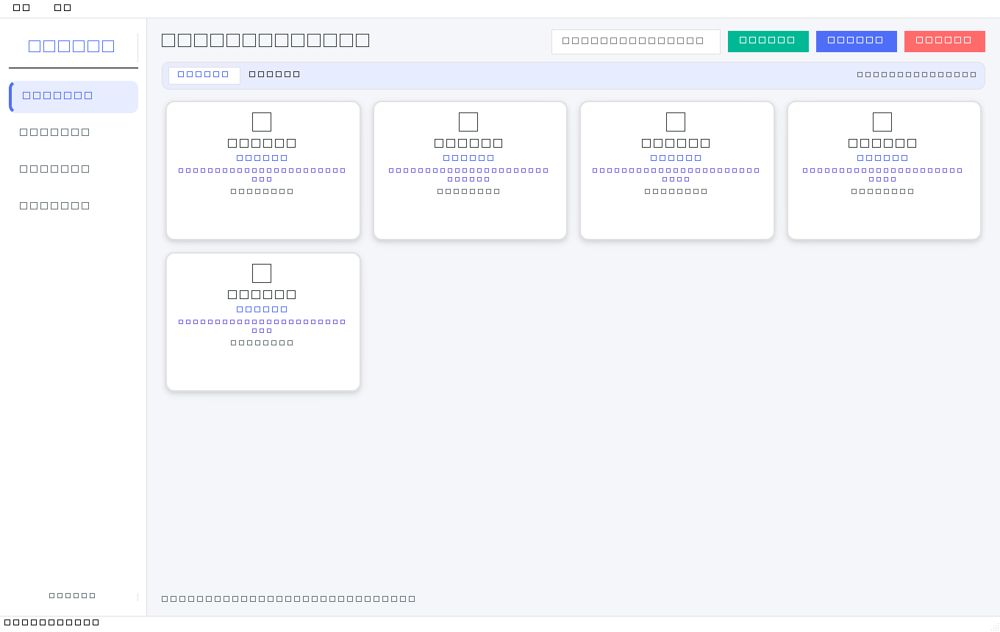
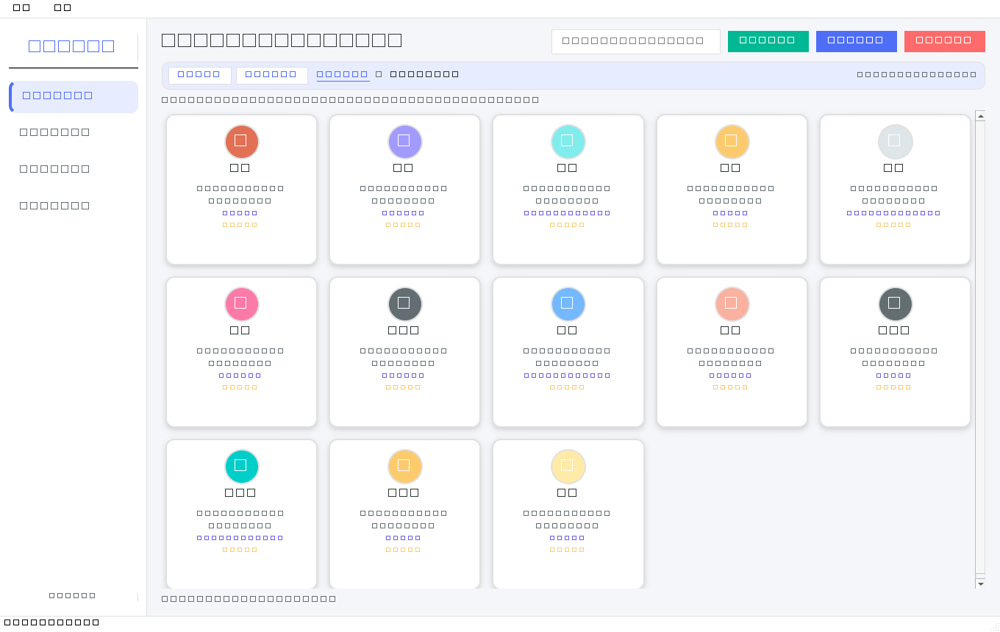
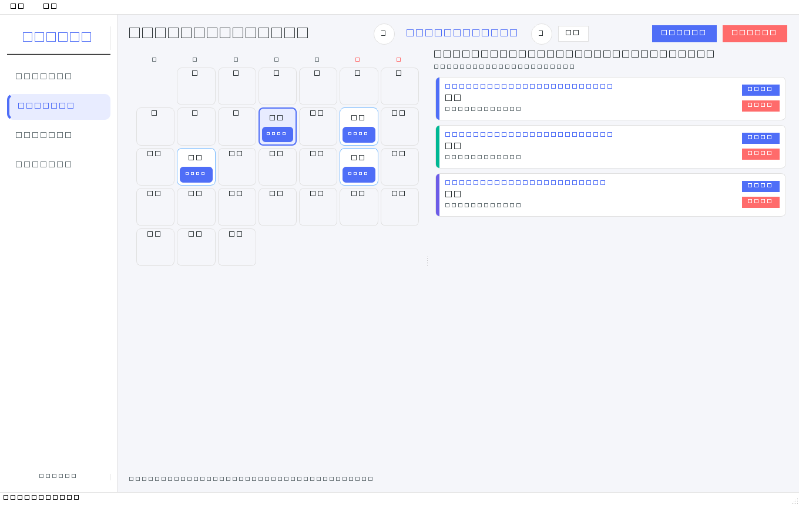
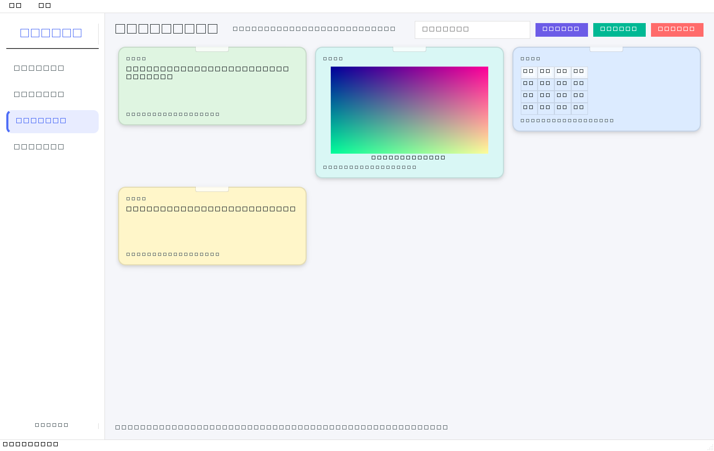
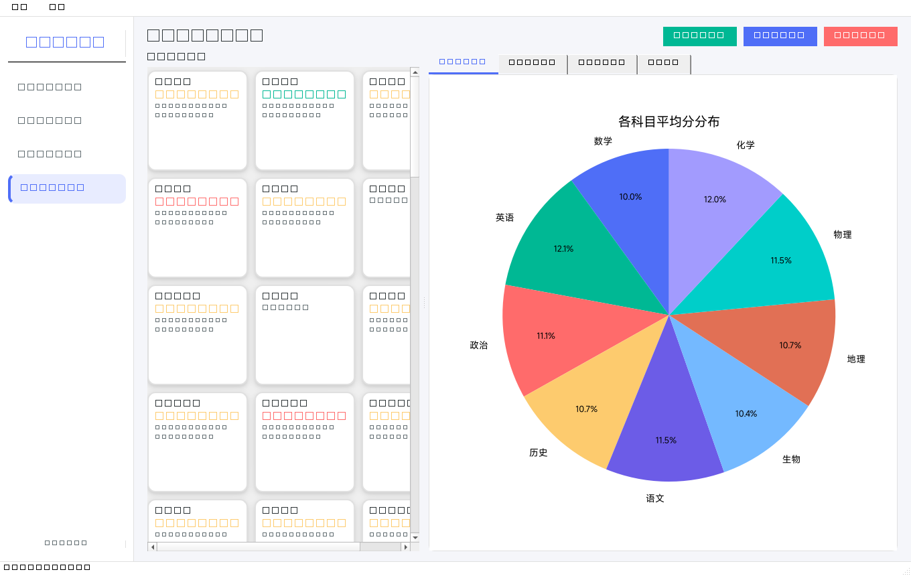

<div align="center">

# 🎓 教学管理系统 · Teaching Management System

**AI 生成的教师工作台 · 为需要同时管理多个学生的老师而设计**
<sub>AI-Generated Program, designed for the teachers who teach multiple students.</sub>

**本地离线运行的教师工作台**：学生 / 排课 / 便签 / 成绩，一个程序全搞定


-41CD52)


</div>

---

## ⚠️ 重要提示（先读这 6 条）

| # | 重要事项 | 说明 |
|---|---|---|
| 1 | **v1.3.1 修复了「打开课程管理时瞬间闪出多个程序窗口」的严重 BUG** | 根因：日历格/课程条/磁贴等控件构造时未指定父控件，被 Qt 当成顶层窗口创建；清理时 `setParent(None)` 又让它们退回顶层。现已全部指定父控件并改为 `hide()+deleteLater()` 清理，实测顶层窗口数恒定不再闪烁。**请务必更新到 v1.3.1** |
| 2 | **macOS 的 `.dmg` 必须在 Mac 上生成** | PyInstaller 不支持交叉编译，DMG 还需要 macOS 自带 `hdiutil/iconutil`。本仓库提供两种方式：① 在 Mac 上执行 `packaging/macos/build_macos.sh` 一条命令产出 `.app` + `.dmg`；② 使用内置 GitHub Actions，云端 macOS runner 自动产出（无需自己有 Mac） |
| 3 | **数据保存在本机 SQLite，注意备份** | 便携模式=程序目录；不可写时回退 `~/Library/Application Support/TeachingManager/`(macOS) 或 `%APPDATA%\TeachingManager\`(Windows)。菜单 **文件 → 打开数据目录** 可直达；备份=连同 `feedback_images/` 一起复制 |
| 4 | **字体：界面与图表优先使用 MiSans** | 系统未安装 MiSans 时 macOS 自动用**苹方 PingFang SC**、Windows 用微软雅黑、Linux 用思源黑体。也可把 `MiSans.ttf` 放进程序目录的 `fonts/` 文件夹，程序启动自动加载 |
| 5 | **便签墙支持直接贴图/贴表格（剪贴板用法）** | 截图或从 Excel 复制后，在便签墙点「📋 粘贴新建」或按 `Ctrl+V`，程序会自动判断是**图片 / 表格 / 文字**并生成便签；便签图片存在数据目录的 `feedback_images/` |
| 6 | **旧版 `.doc` 仅 Windows 可用** | `.doc` 依赖 Windows COM + 已安装 Word；macOS/Linux 请先另存为 `.docx`。`.docx/.xlsx/.xls/.csv` 全平台可用 |

---

## ✨ 重点特性

- 🏫 **学生管理改为「班级总览 → 点入班级」两级浏览**（带滑动+视差过渡动画），磁贴**头像在上、完整姓名在头像正下方**，彻底解决姓名与图标重叠
- 🧭 **页面导航栏**：`← 上一页` + **可点击面包屑**（`🏠 班级总览 › 高一(1)班 › 🔍 搜索：张`），点任意一段即可跳回那一页
- 📅 **排课系统改为月历视图**：**有课的日期显示「N 节课」徽标**并高亮（今天红色虚线框），**点选日期展开当天课程详细时间安排**（时间/科目/教师/地点/备注，含时长）
- 🗒 **便签墙（原反馈系统重构）**：像剪贴板/贴纸便签一样贴**文字、表格、图片**；**不再限定日期/范围，统一展示**；支持智能粘贴、置顶、配色、搜索、大图查看
- ✏️ **每个磁贴都能编辑**：学生 / 班级 / 便签 / 成绩 / 当天课程——**悬停磁贴右上角出现 ✏️🗑 按钮**，右键菜单同样带「编辑/删除」
- 🗑 **单个 + 批量删除**：勾 1 个即单个删除，勾多个即批量；删除学生**自动级联清理其成绩**，删除便签自动清理图片文件
- 📊 **成绩管理**：分数分布 / 科目对比 / 趋势图 + 学生个人成绩报告（图表中文不再出现方块）
- 🍎 **真正的跨平台**：Windows / macOS / Linux 同一份代码；macOS 已适配苹方字体、原生菜单角色、Retina 高DPI、数据目录自动回退
- 🔒 **完全离线**：数据只存在本机 SQLite，不联网、不上传
- ✅ **三套自动化测试**：89 项逻辑 + 23 项界面/新功能 + 平台与打包适配检查（含防「游离顶层窗口」回归）

---

## 🖼 界面预览

| 学生管理 · 班级总览 | 点入班级（含导航栏面包屑） |
|:---:|:---:|
|  |  |

| 排课 · 月历标记 + 当天课表 | 便签墙 · 文字/表格/图片 |
|:---:|:---:|
|  |  |

| 成绩 · 统计图表 + 个人报告 |
|:---:|
|  |

---

## 🚀 快速开始

### Windows

```powershell
# 方式 1：下载 Release 中的 教学管理系统.exe 双击运行（首次启动解压需 10~30 秒）

# 方式 2：从源码运行
pip install PySide6 matplotlib openpyxl python-docx xlrd
python teaching_manager.py
```

### macOS

```bash
# 方式 1（推荐）：在 Mac 上一条命令产出 .app 与 .dmg
cd packaging/macos && chmod +x build_macos.sh && ./build_macos.sh
#   → dist/教学管理系统.app
#   → 教学管理系统-1.3.1-macOS.dmg（拖入 Applications 即可）

# 方式 2：从源码运行
pip3 install PySide6 matplotlib openpyxl python-docx xlrd
python3 teaching_manager.py
```

> 首次打开未签名的应用若提示「无法验证开发者」：访达中**右键 → 打开**，或执行
> `xattr -dr com.apple.quarantine "/Applications/教学管理系统.app"`

### Linux

```bash
pip install PySide6 matplotlib openpyxl python-docx xlrd
python teaching_manager.py
```

---

## 🧩 四个模块怎么用

| 模块 | 关键操作 |
|---|---|
| 👥 **学生管理** | 首页是**班级磁贴**（人数 + 标签统计）→ 点入查看该班学生；顶部搜索可跨班级检索；导航栏可返回上一页或点面包屑跳转；磁贴悬停 ✏️/🗑 或右键编辑删除 |
| 📅 **排课管理** | 月历中点一个日期 → 右侧展开**当天课程时间安排**；「➕ 新建课程」为当天排课；课程行有 ✏️/🗑，双击也可编辑；「今天」一键回到当天 |
| 🗒 **便签墙** | 「📋 粘贴新建」把剪贴板内容变成便签（图片/表格/文字自动识别）；「➕ 新建便签」可切换三种类型、选颜色；便签支持 📌 置顶、✏️ 编辑、🗑 删除、📋 复制内容 |
| 📊 **成绩管理** | 「📥 导入成绩」或「➕ 手动录入」；点学生磁贴看统计图，双击看个人成绩报告；磁贴 ✏️ 打开该生成绩表逐条改 |

**导入表格格式**

- 学生表：`学号 | 姓名 | 班级 | 标签 | 头衔`（`.xlsx .xls .docx .csv`）
- 成绩表：`姓名 | 科目 | 成绩 | 考试日期 | 考试类型`（`.xlsx .xls .csv`）
- 学号重复自动去重；空行跳过；考试日期支持 Excel 真实日期格与 `2026/6/1` 文本

---

## 🗂 项目结构

```
.
├── teaching_manager.py                 # 主程序（单文件，约 5.8k 行）
├── packaging/macos/                    # macOS 打包流水线
│   ├── build_macos.py / build_macos.sh # 一键：依赖→图标→.app→签名→.dmg
│   ├── TeachingManager.spec            # PyInstaller 规格（.app / Info.plist / 架构）
│   ├── README-macOS.md                 # macOS 构建、签名公证、FAQ
│   └── assets/                         # 图标（make_icon.py 自动生成 png/ico）
├── .github/workflows/
│   ├── build-macos.yml                 # 云端 macOS 构建 → 产出 DMG 工件
│   └── tests.yml                       # 三平台自动跑测试
├── tests/                              # 自动化测试（89 + 23 + 平台）
│   ├── logic_test.py                   # 数据层/导入/迁移/删除
│   ├── gui_smoke.py                    # 界面、新功能、游离顶层窗口回归
│   ├── platform_test.py                # 跨平台适配与打包约束
│   └── gen_data.py / snapshots.py      # 样例数据生成 / 界面截图
├── samples/                            # 示例导入表格（xlsx/xls/docx/csv）
└── docs/                               # 使用说明 + 界面截图
```

---

## 🧪 测试与打包

```bash
# 跑全部测试（无头，无需显示器）
python tests/gen_data.py          # 首次：生成虚拟学生表/成绩表
python tests/logic_test.py        # 89 项：数据库、导入、级联删除、老库迁移
python tests/gui_smoke.py         # 23 项：四模块渲染、班级导航、月历、便签、磁贴编辑
python tests/platform_test.py     # 跨平台与防回归约束（含“禁止游离顶层窗口”）
python packaging/macos/check_workflow.py   # 校验 CI 工作流

# Windows 打包（单文件 exe）
pyinstaller --noconfirm --clean --onefile --windowed --name TeachingManager \
  --icon packaging/macos/assets/icon.ico --add-data "packaging/macos/assets/icon.png;." \
  teaching_manager.py

# macOS 打包（.app + .dmg）
python3 packaging/macos/build_macos.py            # 或 ./build_macos.sh
python3 packaging/macos/build_macos.py --arch universal2   # 通用二进制
python3 packaging/macos/build_macos.py --sign "Developer ID Application: XXX (TEAMID)"
```

---

## ❓ 常见问题

| 现象 | 处理 |
|---|---|
| 打开课程管理时闪出多个窗口 | 这是 v1.3.0 及更早版本的 BUG，**升级到 v1.3.1** 即可（根因与修复见上「重要提示 1」） |
| 双击 `.app` 没反应 | 终端执行 `"/Applications/教学管理系统.app/Contents/MacOS/教学管理系统"` 看报错 |
| 提示「应用已损坏」 | `xattr -dr com.apple.quarantine <应用路径>` |
| 图表中文变方块 | 安装 MiSans 或把 `MiSans.ttf` 放进 `fonts/`；macOS 自带苹方即可 |
| 想指定数据位置 | 设环境变量 `TMS_DATA_DIR=/path/to/data` 再启动 |
| 任务管理器里有 2 个同名进程 | PyInstaller 单文件版的引导进程 + 应用进程，属正常现象 |
| 想减小体积 | macOS 打包已排除 QtWebEngine/QtQuick 等无用模块；`.app` 约 300~400MB 属正常（Qt + matplotlib + numpy） |

---

## 📄 文档

- 📘 [使用说明（中文详版）](docs/使用说明.txt)
- 🍎 [macOS 打包与签名公证指南](packaging/macos/README-macOS.md)
- 📝 [更新日志 CHANGELOG](CHANGELOG.md)

---

## 📜 许可证

本项目采用 **Apache License 2.0**，详见仓库根目录的 [LICENSE](LICENSE)。

```
Copyright (c) 2026 Asell Bucks
Licensed under the Apache License, Version 2.0
```

---

## 🙌 反馈

欢迎在 Issues 中反馈问题或建议；提交问题时请附上：操作系统与版本、程序版本（「关于」对话框可见）、复现步骤。
